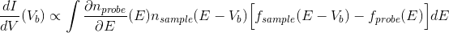

# Deconvolve

This set of code assists in finding the electron energy distribution of a sample, which can be found in the integral of the equation below:

This method uses a least squares method to find the best fit to the data. Currently, this script is specific only to superconducting tunneling spectroscopy, but it should be trivial to generalize this.

# Getting started

## Requirements

Coming soon.

# Contributing

If you can think of ways to make the parameter inputs less confusing and to make some parts take advantage of vectorization, that'd be extremely helpful.

# Authors

* Jeff Damasco

